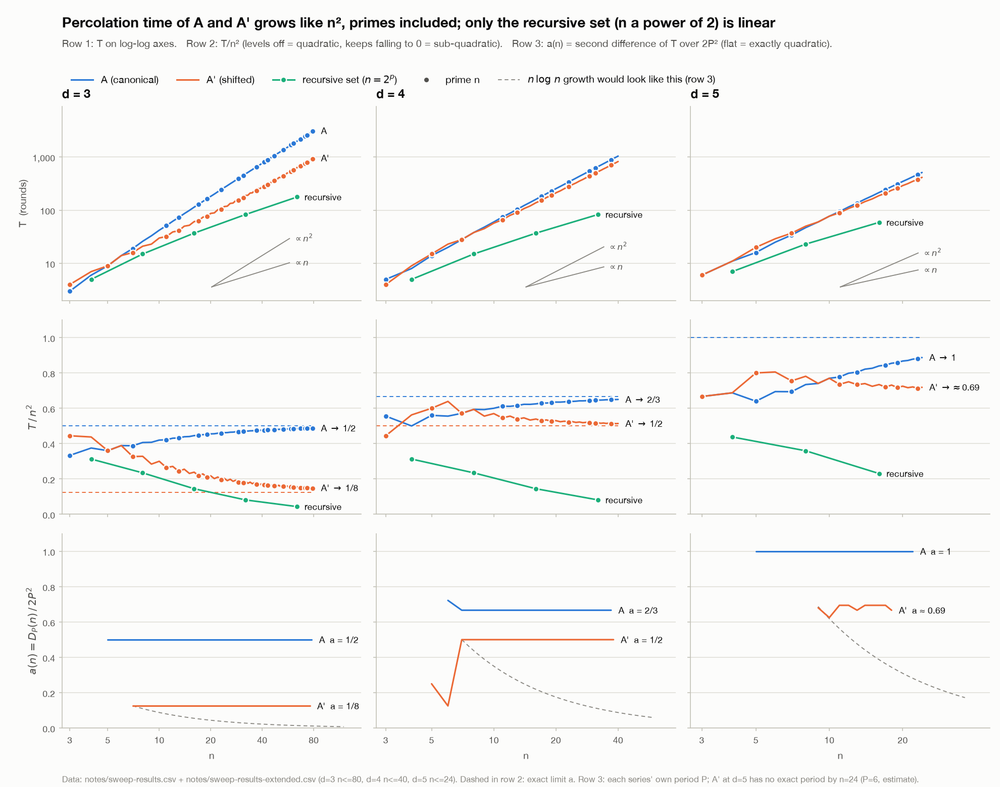

# Log — Question 7 (bootstrap percolation on grids)

## 2026-10-03 — `sage/hand_verify.py`: brute-force ground truth

Pure-Python simulator of d-neighbour (r = d) bootstrap percolation on [n]^d.
Synchronous rounds; "rounds taken" = number of rounds that infected >= 1 new vertex
(= T(A) when A percolates). Run: `python3 sage/hand_verify.py` (~55 s total).

### Canonical set A = ⋃_{i=1}^d V_{in}, d = 3 — exact results

| n | \|V_n\|, \|V_2n\|, \|V_3n\| | \|A\| | percolates? | **T(A)** | \|A_t\|, t = 0..T |
|---|---|---|---|---|---|
| 3 | 1, 7, 1  | 9  = 3² | yes | **3** | 9, 15, 21, 27 |
| 4 | 3, 12, 1 | 16 = 4² | yes | **6** | 16, 30, 34, 40, 49, 61, 64 |

- Layer sizes were also counted by hand (bounded compositions) and agree.
- n = 3, round 1 checked by hand: the 3 permutations of (2,2,1) and the 3 of (3,2,2)
  each have exactly 3 infected neighbours → |A_1| = 9 + 6 = 15. Matches the simulator.

### Is n^(d-1) the minimum? (n = 3, d = 3, bound = 9)

- Argument: P(S) = 2d|S| − 2e(S) never increases under the r = d rule (Δ = 2d − 2a ≤ 0
  for a ≥ d infected neighbours), ends at 2d·n^(d-1), starts at <= 2d|A| ⇒ |A| >= n^(d-1).
  (My own sketch, not checked against the paper — treat as a hypothesis; the brute force
  below is the real check. It is consistent with Theorem 1 of the paper.)
- Brute force: percolation is monotone in A, so it suffices to test size 8 exactly.
  All C(27,8) = 2,220,075 subsets of size 8 tested: **0 percolate**.
  Positive control: the same search finds a percolating 9-set immediately.
  ⇒ for n = d = 3 the minimum percolating set size is exactly 9 = n^(d-1).

### Simulator calibration (brute-force m_d(n) over all optimal-size sets)

- d = 2, n = 2..5: m_2(n) = 1, 2, 3, 4 = n − 1. **Matches Theorem 2.**
- d = 1, n = 2..7: m_1(n) = 1, 1, 2, 2, 3, 3 = ⌊n/2⌋.
  **Discrepancy with refs/code-context.md**, which says m_1(n) = ⌈n/2⌉ (differs for odd n).
  For a path the best single seed is the middle vertex, T = max(v−1, n−v) = ⌊n/2⌋, so the
  simulator is right for the graph as defined, and the summary (or the paper's convention)
  is the thing to check. NOT yet verified against the PDF (no PDF tooling installed here:
  no pdftotext / pdftoppm). Irrelevant to Question 7 (d >= 3) but fix code-context.md once
  the paper's exact statement is confirmed.

## 2026-10-03 — Growth of T(A), T(A') in n: anything sub-quadratic for non-powers of 2?

**Question** (decides explicit construction vs. sharper potential-function argument): for n that are
not powers of 2, primes especially, do T(A) (canonical) and T(A') (shifted, V_{in-⌊n/2⌋}) grow
linearly, like n log n, or like n² (the Theorem 2 bound)?

**Answer: Θ(n²). A' is not sub-quadratic for primes, and nothing else tested is either.** For d = 3, 4
(and A at d = 5), T is *exactly* a degree-2 quasi-polynomial in n with a strictly positive leading
coefficient over the whole range tested (d = 3: n = 3..80), with no exceptions at primes. A' beats A
by a constant factor (4× asymptotically at d = 3), not by a better exponent.

### Data and method
- `notes/sweep-results.csv` (n = 3..20) + new `notes/sweep-results-extended.csv` (d=3 n ≤ 80, d=4 n ≤ 40,
  d=5 n ≤ 24; produced by the same `sage/sweep.py`, so same preflight tests). Analysis:
  `sage/analyze_growth.py` (numpy + exact Fractions); figure: `sage/plot_growth.py` (matplotlib, see
  "Figure" below).
- Test: lag-P second difference D_P(n) = T(n+2P) − 2T(n+P) + T(n). If T = a·n² + (linear terms whose
  coefficients depend only on n mod P), then D_P ≡ 2aP² exactly. If T ~ c·n log n, D_P ~ cP²/n would
  shrink ~25× between n = 3 and n = 80; if T were linear, D_P → 0.

### Results
Leading coefficient a (T ≈ a·n²), read off an exactly constant D_P over the stated range:

| d | A (canonical) | A' (shifted) | Theorem 2 constant d+2 (*) |
|---|---|---|---|
| 3 | **1/2**, period 2, n = 3..80 | **1/8**, period 4, n = 3..80 | 5 |
| 4 | **2/3**, period 3, n = 4..40 | **1/2**, period 2, n = 5..40 | 6 |
| 5 | **1**, period 2, n = 3..24 | no exact pattern by n = 24; a ≈ 0.67–0.69 | 7 |

(*) from refs/code-context.md, (d+2)n² + n; not re-checked against the PDF.

d = 3 closed forms, asserted for every n = 3..80 (a conjecture beyond that):
`T(A) = ⌊(n² − 2n + 4)/2⌋`; `T(A') = ⌈n²/8 + 2n − 3⌉` for even n, and for odd n the same expression at
n − 1, plus 2. The pattern is exact from n = 3 on (no transient). At d = 4 only n = 3 (A) and n = 3, 4
(A') are off-pattern.

**Primes are not special.** All primes in the stable range (21 of them at d = 3) lie on the same class
polynomial as the composites with the same residue mod P: 0 exceptions. At d = 3, T(A') at odd n ≥ 5 is
T(n−1) + 2. Prime n at d = 3:

| n | 3 | 5 | 7 | 11 | 13 | 17 | 19 | 23 | 31 | 47 | 61 | 79 |
|---|---|---|---|---|---|---|---|---|---|---|---|---|
| T(A) | 3 | 9 | 19 | 51 | 73 | 129 | 163 | 243 | 451 | 1059 | 1801 | 3043 |
| T(A') | 4 | 9 | 16 | 32 | 41 | 63 | 76 | 104 | 172 | 356 | 569 | 916 |
| T(A')/n² | .444 | .360 | .327 | .264 | .243 | .218 | .211 | .197 | .179 | .161 | .153 | .147 |

### Figure

Dots mark primes. Row 1: T on log-log axes with ∝ n and ∝ n² guides. Row 2: T/n²: A and A' level off at
their exact limits (dashed) while the recursive set keeps falling. Row 3: the exact second-difference
test, a(n) = D_P(n)/2P², flat for every exactly-patterned series, against the 1/n decay that n log n
growth would give (dashed gray; anchored on A''s plateau). A' at d = 5 has no exact period by n = 24, so
its row-3 line is the noisy P = 6 estimate. Series colours are the dataviz palette's categorical slots
1–3; the validator passes light mode all-pairs (contrast WARN for the aqua recursive set, relieved by
direct labels and the tables here). Regenerate with `~/miniforge3/envs/sage/bin/python
sage/plot_growth.py` (matplotlib lives in the conda env `sage`, not in the default `python3`).

### Why eyeballing at n ≤ 20 would have misled (all three traps are visible in this data)
1. Naive log-log slope of T(A') at d = 3 is 1.56 on n ∈ [8, 20], but the doubling exponents
   log₂(T(2n)/T(n)) are 1.54, 1.67, 1.79 for n = 10, 20, 40: creeping up to 2, because
   T(A') = n²/8 + 2n − 3 and the linear term dominates until n ≈ 16.
2. T/n² falling steadily (.444 → .147 over the primes above) is not evidence of sub-quadratic growth: it
   converges to 1/8 like 1/8 + ~1.75/n.
3. Smooth fits separate poorly on the 7 primes up to 19 (A' at d = 3: RMS 0.25 rounds quadratic vs 0.48
   n log n). On the extended data, RMS residual (rounds) for primes n ≥ 5 at d = 3: A: quadratic 0.00,
   n log n 45, linear 226; A': 0.25, 11.3, 56. Constant D_P is the sharper test.

### Not asked, but it decides how much "A' is quadratic" means: all residue classes, d = 3
A and A' are two members of the family {v : Σv ≡ c (mod n)}, all of size n^(d-1). Scanned every c for
every n = 3..44: **every class percolates**. The best class is c = (n+3)/2 for every odd prime tested
(5..43), one step past A''s class (n+1)/2, and is only ~7% faster than A' (n = 43: 283 vs 304). Its time
is exactly quasi-quadratic with a = 1/8 (D₄ ≡ 4, n = 3..36), same as A'; the worst class has a = 1/2. So
every class is Θ(n²) with constant between 1/8 and 1/2: A' is not an unlucky shift.

### Contrast: the recursive set at n = 2^p is linear
d = 3, T = 5, 15, 37, 83, 177 for n = 4, 8, 16, 32, 64 (T/n = 1.25 … 2.77, tending to d; T/n² = .043
at n = 64 and falling like 1/n). Versus A' at the same n: 7, 21, 61, 189, 637, so the gap widens linearly
(1.4×, 1.4×, 1.6×, 2.3×, 3.6× from n = 4 to 64). These are the nim-sum sets {x : x₁⊕…⊕x_d = 0}, which are
not residue-class sets.

### What this means for the decision (my reading, not a theorem)
1. Don't try to prove A' (or A) is o(n²): the data say it is false, with no sign of a regime change
   through n = 80 at d = 3. If the (d+2)n² + n bound is for the canonical set (as code-context.md
   suggests; unverified), it is already tight for A up to the constant (a = 1/2, 2/3, 1 vs 5, 6, 7), so a
   sharper potential-function argument on A can only improve the constant.
2. So o(n²) for general n needs a different initial set. That favors the explicit-construction route; the
   potential-function / witness-tree machinery is then the tool for bounding T of whatever set is found.
   The two routes are not alternatives.
3. The only fast sets known are the XOR ones at n = 2^p. Primes have no digit structure to imitate, and
   the residue-class family is exhausted at d = 3, so primes need a genuinely new idea (e.g. code-context
   line of attack 2, padding/embedding into 2^p).

### Not established
- Nothing here says no optimal-size set has o(n²) time for prime n; m_d(n) itself is untouched. Only A, A'
  and the residue classes were examined.
- Extrapolation past n = 80 (d=3), 40 (d=4), 24 (d=5) is conjecture. A' at d = 5 has no exact formula
  yet; that likely needs n ≳ 40 at d = 5 (~10⁸ cells).
- Every T comes from `simulate.py`, validated against the brute-force simulator on small cases. Extra:
  24 prime-n rows (d=3 primes 11..31, d=4 primes 7, 11, 13, d=5 primes 5, 7) were re-derived with the
  pure-Python `hand_verify.percolate` on sets built from the literal layer definitions: all match.

### Suggested next experiments (not run)
(a) heuristic search (hill-climbing / annealing over percolating sets of size n^(d-1), objective T) at
n = 5, 7, 11, d = 3: the first direct evidence on whether T can fall far below n²/8 for primes, and
what such sets look like; (b) adapt the recursive set of the next power of 2 down to [n]^d and measure
T at primes; (c) exhaustive m_3(3) (4.7M sets, minutes) as one ground-truth value at a prime.

Reproduce: `python3 sage/analyze_growth.py` (seconds), `--residue-classes` adds ~100 s; the figure with
`~/miniforge3/envs/sage/bin/python sage/plot_growth.py`. The extended sweeps are the three
`sage/sweep.py` commands in the `analyze_growth.py` docstring.
